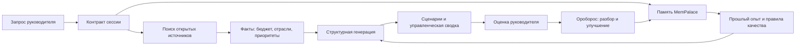

# ИИ-штаб госсектора:

## 1. Главная идея

ИИ-штаб госсектора - это не просто чат с моделью. Это рабочее место, которое собирает разрозненную информацию о регионе, превращает ее в управленческую картину и постепенно учится на обратной связи.

Система решает четыре практические задачи:

1. Быстро понять, что реально происходит в регионе: бюджет, отрасли, приоритеты, открытые документы, закупки, новости и стратегические программы.
2. Сформировать несколько сценариев: от осторожного партнерства до инфраструктурных, цифровых, социальных и отраслевых инициатив.
3. Сохранить управленческую память: какие формулировки были полезны, какие подходы стоит повторять или больше не использовать.
4. Постепенно повышать качество выводов: каждая сессия, оценка и правка становятся материалом для следующей генерации.

## 2. Как работает процесс

Пользователь создает сессию: регион, задача, контекст встречи, фокус или отрасль. Далее система запускает несколько слоев работы.

На выходе руководитель видит не длинный текст ради текста, а набор рабочих блоков:

- что найдено в бюджете;
- что известно по отраслям;
- какие приоритеты региона видны на горизонте пяти лет;
- какие сценарии следуют из этих фактов;
- где есть риски, пробелы и точки для следующего поиска.

## 3. Компоненты системы

### Витрина

Веб-приложение и Telegram Mini App. Руководитель может открыть систему из браузера или из бота, создать сессию, посмотреть материалы, дать оценку и вернуться к прошлым выводам.

### Оркестратор

Next.js-приложение управляет сессиями, генерацией, хранением результатов и отображением блоков. Оно не просто отправляет один промпт в модель, а собирает контекст из нескольких источников, проверяет структуру ответа и сохраняет результат.

### Поисковый слой SearXNG

Система ищет открытые данные по региону и теме: официальные документы, закупки, новости, справочные источники, отраслевые материалы. Поиск нужен для того, чтобы сессия не превращалась в общую презентацию "про цифровизацию", а опиралась на факты: бюджетные акценты, отраслевые сигналы, текущие приоритеты региона.

### LLM Gigachat

Модель используется как аналитический сборщик и редактор: она не должна придумывать факты, а должна превращать найденные материалы, память и правила качества в структурированный результат.

### MemPalace

MemPalace - это память системы. Он хранит не только историю диалогов, а управленческие следы: сессии, ответы, обратную связь, правила, улучшения и повторяемые паттерны.

### Ороборос

Ороборос - это контур эволюции. Он смотрит на результат не как генератор первого ответа, а как внутренний ревизор: что в ответе слабое, что надо переписать, какое правило качества нужно добавить, как следующий ответ должен стать точнее.

## 4. MemPalace

MemPalace можно объяснять как "корпоративную память ИИ-штаба".

Он работает через MCP-интерфейс и локальное хранилище векторной памяти. Каждый сохраненный элемент становится отдельным "drawer" - ячейкой памяти с типом, комнатой и источником.

Что туда попадает:

- созданные сессии;
- сгенерированные ответы;
- оценки руководителя;
- замечания к качеству;
- новые правила, возникшие после разбора ошибок;
- результаты эволюции ответа.

Как это используется:

1. Перед новой генерацией система ищет в MemPalace похожие прошлые кейсы.
2. Возвращает не все подряд, а релевантные фрагменты: регион, отрасль, управленческий тип задачи, прошлые замечания.
3. Эти фрагменты добавляются в контекст генерации.
4. Если руководитель поставил низкую оценку, причина становится правилом: больше не повторять слабый подход.
5. Если ответ был полезен, хороший паттерн тоже сохраняется.

Управленческая ценность MemPalace:

- система перестает каждый раз начинать с нуля;
- появляется память вкуса руководителя;
- удачные формулировки и аналитические рамки переиспользуются;
- слабые подходы постепенно вычищаются;
- можно накапливать институциональную память по регионам и отраслям.

Важно: MemPalace не заменяет базу документов. Это слой смысловой памяти: он помогает находить похожий опыт и управленческие правила, а не хранить бухгалтерскую первичку.

## 5. Ороборос

Ороборос - это рабочий контур самоулучшения ИИ-штаба.

Если основная модель отвечает на задачу, то Ороборос разбирает, почему ответ получился сильным или слабым. Его роль ближе к внутреннему методологу и редактору качества.

Что делает Ороборос:

- получает исходную сессию, ответ, оценку и комментарий руководителя;
- находит проблему: слишком общий текст, слабая привязка к фактам, плохая структура, отсутствие сценариев, неверный тон;
- предлагает улучшение;
- формулирует новое правило качества;
- переписывает ответ в более полезном виде;
- передает результат обратно в память.

Формат работы Оробороса строгий: на выходе ожидается структурированный результат, а не свободное рассуждение. Это позволяет системе автоматически сохранить новое правило, обновить playbook и использовать его в будущих сессиях.

Как он работает технически:

- через A2A-контур Ороборос публикует agent card и принимает задачи по JSON-RPC;
- приложение отправляет задачу методом `message/send`;
- затем проверяет статус задачи через `tasks/get`;
- когда задача завершена, приложение забирает структурированный результат;
- результат проходит валидацию и сохраняется как эволюция ответа.

Как будет развиваться Ороборос:

1. От одиночного ревизора к системе ролей: стратег, отраслевой аналитик, бюджетный аналитик, редактор для правления, риск-аналитик.
2. От исправления одного ответа к анализу серии сессий: какие ошибки повторяются, какие регионы недоисследованы, где не хватает источников.
3. От ручной оценки к управляемому циклу качества: руководитель ставит оценку, Ороборос сам предлагает, что изменить в методологии.
4. От общей памяти к персональным контурам: разные руководители могут иметь разные стили, требования и критерии полезности.

Управленческая ценность Оробороса:

- качество системы растет не только за счет новой модели, но и за счет накопленной методологии;
- руководитель влияет на поведение системы через оценки, а не через переписывание промптов;
- слабые ответы превращаются в правила улучшения;
- появляется контролируемая эволюция, а не хаотичная "магия ИИ".

## 6. Риски и контроль

Основные риски:

- открытые источники могут быть неполными;
- часть документов может быть устаревшей;
- модель может обобщить там, где нужны цифры;
- память может накопить слабые правила, если обратная связь некачественная;
- чувствительные данные нельзя бездумно сохранять в память.

Контрольные меры:

- показывать источники и пробелы;
- отделять факт от гипотезы;
- хранить обратную связь как управляемые правила;
- использовать рейтинг качества;
- иметь режим "не найдено данных", а не выдумывать;
- регулярно чистить и пересматривать память.

